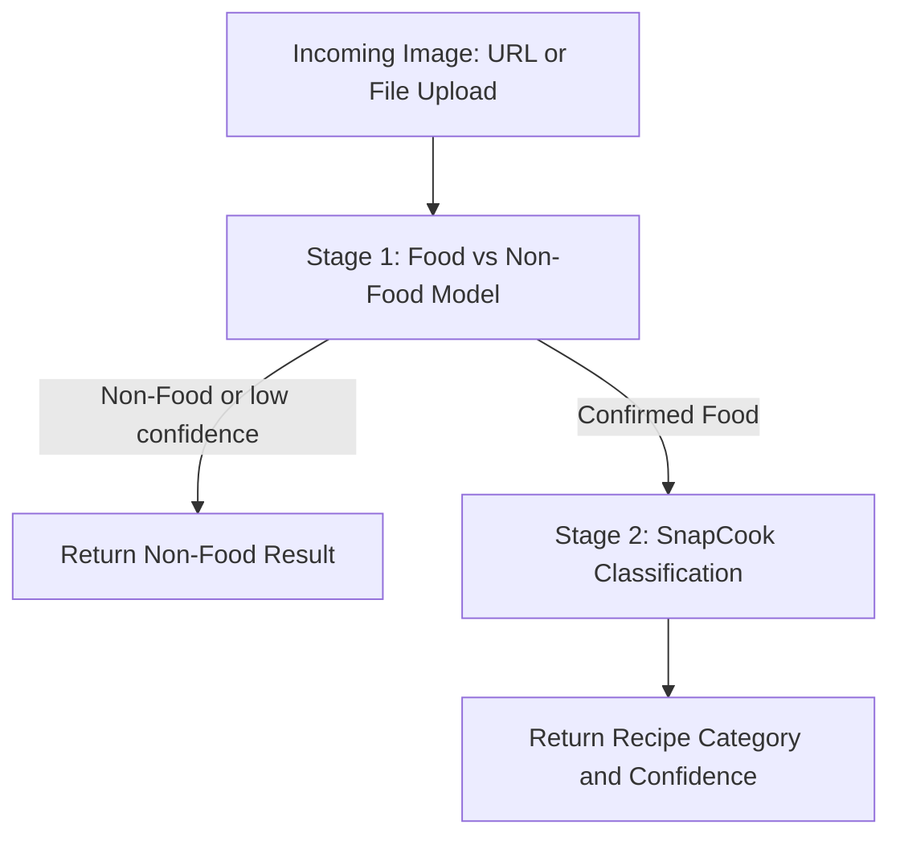

# 🚀 Standalone TFLite Prediction Backend Deployment Guide

This guide explains how to convert, deploy, and host your Python models as a fast, production-ready Flask backend. 

Your models, [food_vs_nonfood.tflite](file:///c:/Users/Prabhakar%20Srivastav/Downloads/SCBackend/food_vs_nonfood.tflite) and [snapcook.tflite](file:///c:/Users/Prabhakar%20Srivastav/Downloads/SCBackend/snapcook.tflite), are executed sequentially to ensure high prediction accuracy.

---

## 🏗️ Architecture Overview

The backend uses a two-stage classification pipeline using the TensorFlow Lite Interpreter for high speed and minimal memory footprint:



---

## 📂 Project Structure

In the `SCBackend` folder, the files are structured as follows:

- [app.py](file:///c:/Users/Prabhakar%20Srivastav/Downloads/SCBackend/app.py): Standalone Flask application implementing prediction endpoints.
- [requirements.txt](file:///c:/Users/Prabhakar%20Srivastav/Downloads/SCBackend/requirements.txt): File specifying Python dependencies for deployment.
- [food_vs_nonfood.tflite](file:///c:/Users/Prabhakar%20Srivastav/Downloads/SCBackend/food_vs_nonfood.tflite): The binary TFLite model.
- [snapcook.tflite](file:///c:/Users/Prabhakar%20Srivastav/Downloads/SCBackend/snapcook.tflite): The multiclass recipe TFLite model.

---

## 🏃 Setup and Running Locally

To run this backend on your local system, follow these steps:

### 1. Set Up a Virtual Environment (Recommended)
Open a terminal in your project directory and run:
```powershell
python -m venv venv
venv\Scripts\activate
```

### 2. Install the Required Dependencies
Install Flask, requests, Pillow, numpy, and TensorFlow or TFLite runtime:
```powershell
pip install -r requirements.txt
```

### 3. Run the Flask Server
```powershell
python app.py
```
Your server will start listening at `http://localhost:8000`.

---

## 🌐 API Endpoint Reference

### 🟢 `GET /`
**Description:** Health check to verify the server is running.

**Response:**
```json
{
  "status": "online",
  "message": "🚀 SnapCook Prediction API is running perfectly!",
  "available_endpoints": {
    "/predict": "POST endpoint accepting image_url in JSON or multipart/form-data for image uploads"
  }
}
```

---

### 🔵 `POST /predict`
**Description:** Classify an image via image URL or direct file upload.

#### A. JSON Input (Image URL)
**Headers:** `Content-Type: application/json`

**Body:**
```json
{
  "image_url": "https://i.ibb.co/7xTpjHph/seriously-good-salmon-poke-bowl-498120.jpg"
}
```

#### B. Direct File Upload (Form Data)
**Headers:** `Content-Type: multipart/form-data`

**Form Body:**
- `file`: (Binary image file attached)

#### Success Responses

##### 1. When categorized as non-food:
```json
{
  "stage": "Food vs Non-Food",
  "prediction": "nonfood",
  "confidence": 98.42
}
```

##### 2. When categorized as food:
```json
{
  "stage": "SnapCook Classification",
  "prediction": "poke_bowl",
  "confidence": 94.18
}
```

---

## ☁️ Deployment Options

To host this backend globally, choose one of these popular options:

### 1. Render (Easiest and Free)
1. Push your project folder to GitHub.
2. Sign in to [Render](https://render.com) and create a new **Web Service**.
3. Connect your repository.
4. Set the following configurations:
   - **Environment:** `Python`
   - **Build Command:** `pip install -r requirements.txt`
   - **Start Command:** `gunicorn app:app` (You can add `gunicorn` to your requirements file for production).

### 2. PythonAnywhere (Free and easy for beginners)
1. Sign in to [PythonAnywhere](https://www.pythonanywhere.com/).
2. Upload your `app.py`, `requirements.txt`, and both `.tflite` model files.
3. Configure a Flask Web App pointing to your `app.py` script.

### 3. Google Cloud Run or AWS ECS (Scale on Demand)
If traffic scales up, containerize your backend using the following simple Dockerfile:

```dockerfile
FROM python:3.11-slim
WORKDIR /app
COPY requirements.txt .
RUN pip install --no-cache-dir -r requirements.txt
COPY . .
CMD ["gunicorn", "--bind", "0.0.0.0:8000", "app:app"]
```
